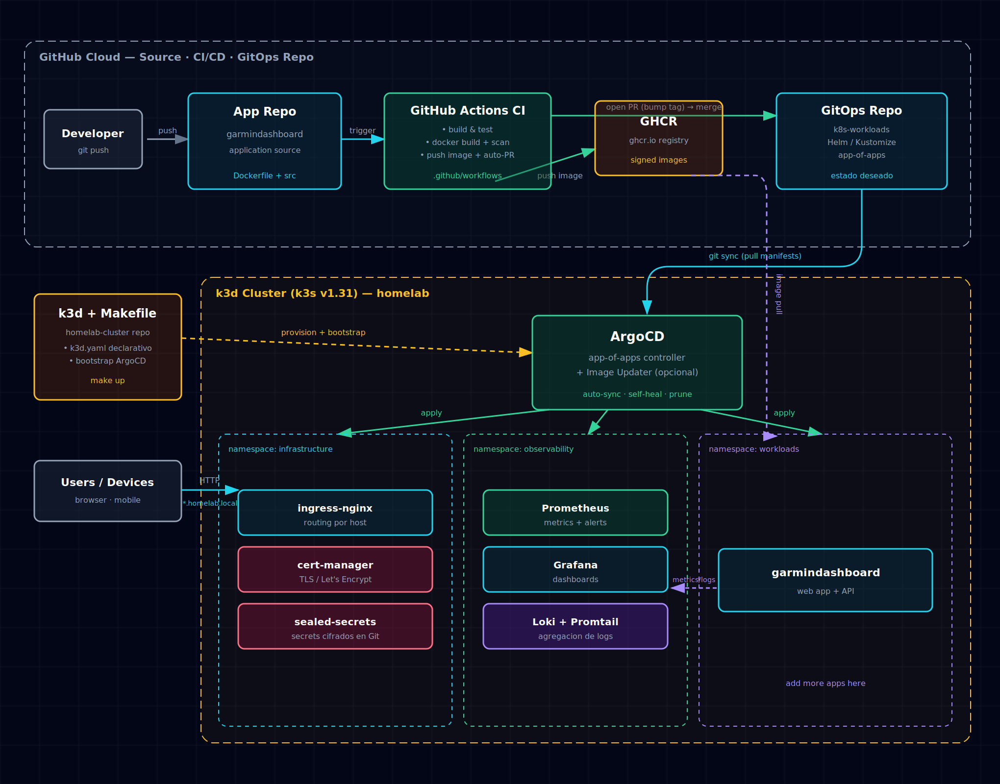

# 🏠 Homelab — GitOps Kubernetes Platform

Infrastructure-as-Code homelab running a **k3d** Kubernetes cluster, fully
driven by **GitOps** with **ArgoCD**, continuous delivery via **GitHub Actions**,
and full **observability** (metrics + logs + alerts).

Everything is reproducible: one `make up` builds the cluster and bootstraps
ArgoCD, which then pulls the entire platform state from Git.

---

## 📐 Architecture



> Interactive diagram: open [`docs/architecture.html`](docs/architecture.html) in a browser.

### The end-to-end flow

```
 dev ──git push──▶ App Repo ──▶ GitHub Actions CI
                                  │  build + test + scan
                                  │  docker build ──▶ GHCR (tag = SHA)
                                  └─ open auto-PR ──▶ homelab-workloads (bump image tag)
                                                          │  merge
                                                          ▼
                                                     ArgoCD (app-of-apps)
                                                 auto-sync · self-heal · prune
                                                          │  apply
                                                          ▼
                                                     k3d Cluster
                                             infra · observability · workloads
```

1. **Push** code to an app repo.
2. **GitHub Actions** builds, tests, scans, pushes the image to GHCR, and opens
   a **pull request** to `homelab-workloads` bumping the image tag.
3. **Merge** the PR → **ArgoCD** detects the Git change and deploys automatically.
4. The cluster itself is created and ArgoCD bootstrapped by **k3d + a Makefile** (IaC).

---

## 📦 Repositories

| Repo | Purpose |
|------|---------|
| **[homelab](https://github.com/acid0ikario/homelab)** | This repo — docs, architecture diagram, master README |
| **[homelab-cluster](https://github.com/acid0ikario/homelab-cluster)** | Cluster IaC — declarative `k3d.yaml` + `Makefile` that create the cluster and bootstrap ArgoCD |
| **[homelab-workloads](https://github.com/acid0ikario/homelab-workloads)** | GitOps source of truth — ArgoCD app-of-apps (infra / observability / workloads) |
| **[homelab-ci](https://github.com/acid0ikario/homelab-ci)** | Reusable GitHub Actions workflow — build → push → auto-PR |

---

## 🚀 Quick start

```bash
# 1. Provision the cluster + bootstrap ArgoCD
git clone https://github.com/acid0ikario/homelab-cluster
cd homelab-cluster && make up

# 2. ArgoCD takes over from here — it pulls homelab-workloads and deploys everything.
#    Watch it converge:
kubectl -n argocd get applications -w

# 3. Get the ArgoCD admin password
kubectl -n argocd get secret argocd-initial-admin-secret \
  -o jsonpath='{.data.password}' | base64 -d; echo
```

### Access the UIs

Services are exposed via **ingress-nginx** on `*.homelab.local`. Add these to your
hosts file (`C:\Windows\System32\drivers\etc\hosts` on Windows, `/etc/hosts` on Linux/WSL):

```
127.0.0.1 argocd.homelab.local grafana.homelab.local prometheus.homelab.local garmindashboard.homelab.local
```

| Service | URL | Credentials |
|---------|-----|-------------|
| ArgoCD | http://argocd.homelab.local | `admin` / (password above) |
| Grafana | http://grafana.homelab.local | `admin` / `changeme` |
| Prometheus | http://prometheus.homelab.local | — |
| garmindashboard | http://garmindashboard.homelab.local | — |

That's it. The whole platform stands up from Git.

---

## 🧱 Stack

| Layer | Components |
|-------|-----------|
| **IaC** | k3d (declarative config), Makefile, k3s v1.31 |
| **GitOps** | ArgoCD (app-of-apps), sealed-secrets |
| **CI/CD** | GitHub Actions (reusable workflow), GHCR, Trivy scan |
| **Networking** | ingress-nginx, cert-manager |
| **Observability** | Prometheus, Grafana, Loki + Promtail |
| **Workloads** | garmindashboard |

---

## 🎯 Design decisions

- **ArgoCD over Flux** — app-of-apps fits the existing `infrastructure/ + workloads/`
  layout, and the UI is genuinely useful in a homelab.
- **Auto-PR over direct image write** — a PR gives an auditable review point in Git
  before anything deploys. (ArgoCD Image Updater is available as an opt-in.)
- **No Rancher/Fleet** — dropped to keep the cluster light; ArgoCD does the real GitOps.
- **sealed-secrets** — secrets live encrypted in Git, safe to commit.

---

## 📄 License

MIT © acid0ikario
